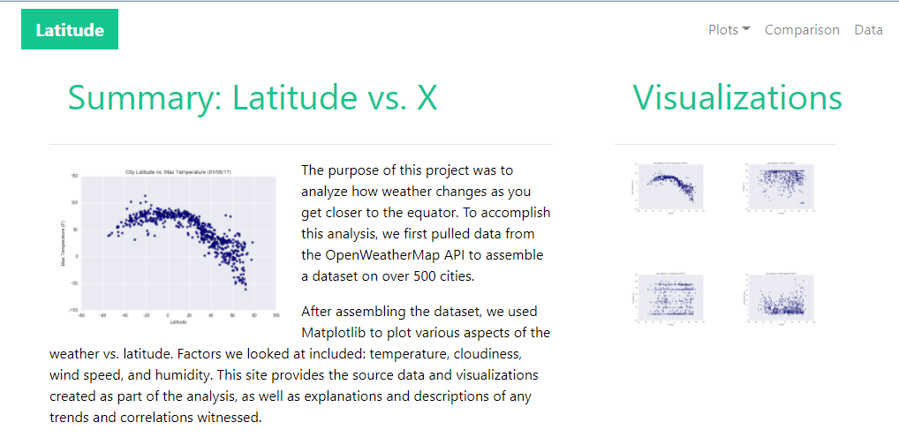
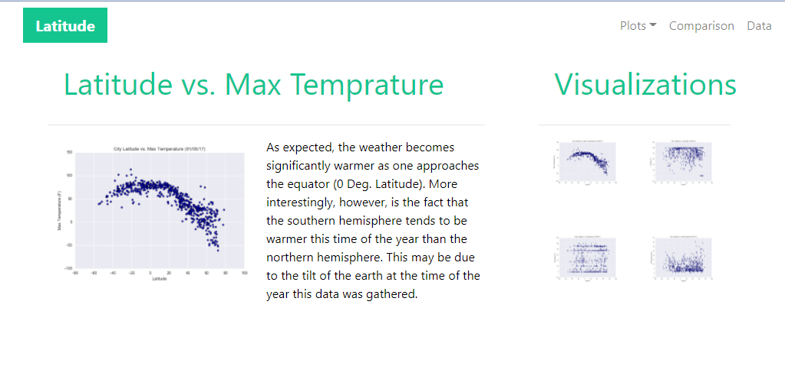
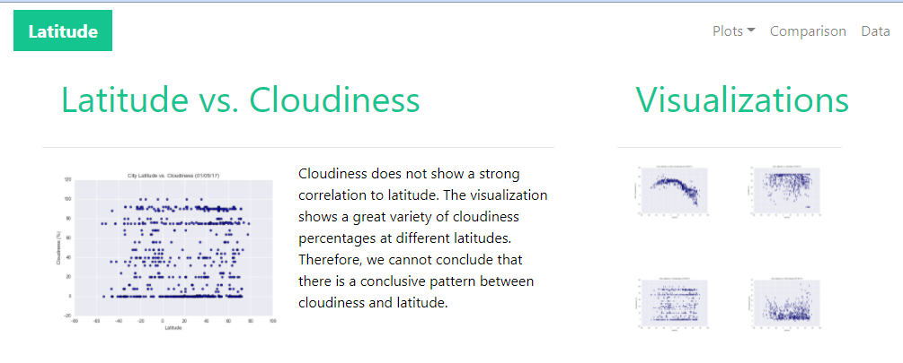
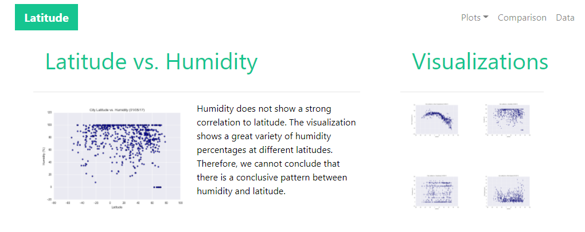
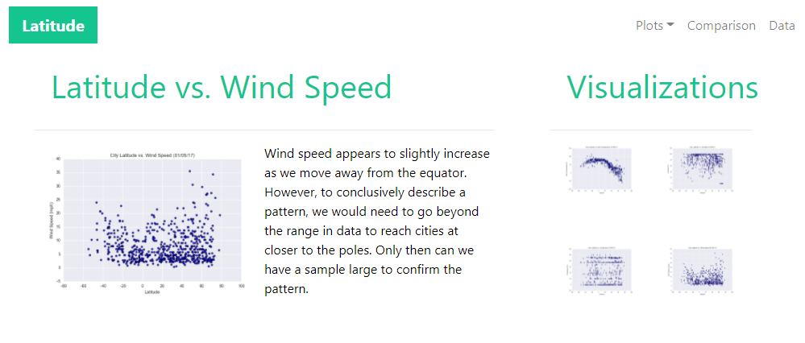
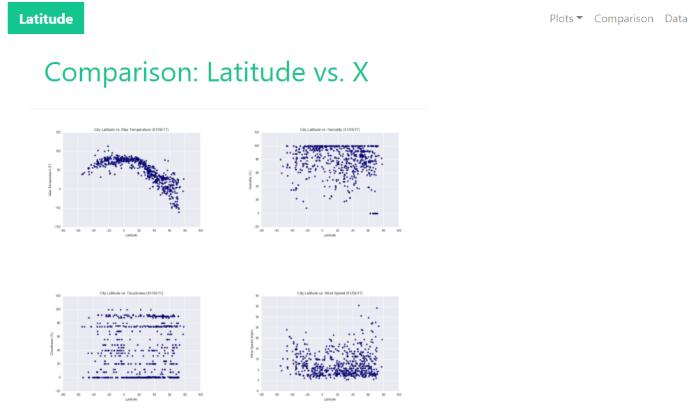
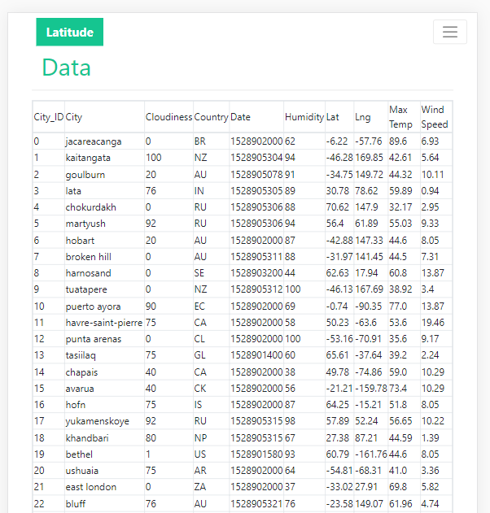

# Web Visualization Dashboard (Latitude):

In creating a visualization dashboard website using the weather data visualizations, a mobile responsive website is designed using html, css and 'Bootstrap' 

# Summary: Latitude Vs. X:

- Here in the landing page, a navigation bar is designed with a  toggle button named "Latitude".

- "Plot" is a dropdown menu link in navigation bar, which takes to the max. temperature, cloudiness, humidity, and wind_speed pages.

-  "Comparison" link leads to a page where above mentioned four visualizations are compared.

- "Data" link leads to "cities" data table.

- Below is the screenshot of "summary verses X" page.

# Latitude Vs. Max Temperature:

- Below is the screenshot of "Latitude Vs. Max Temperature" page.

# Latitude Vs. Cloudiness:

- Below is the screenshot of "Latitude Vs. Cloudiness" page.

# Latitude Vs. Humidity:

- Below is the screen shot of "Latitude Vs. Humidity" page.

# Latitude Vs. Wind Speed:

- Below is the screenshot of "Latitude Vs. Wind Speed" page.

# Comparison Page:

- Below is the screenshot of "Comparison Page" page.

# Data Output:

- Here cities.csv is converted into html and displayed on awebsite page.
- Below is the screen shot for this page.

